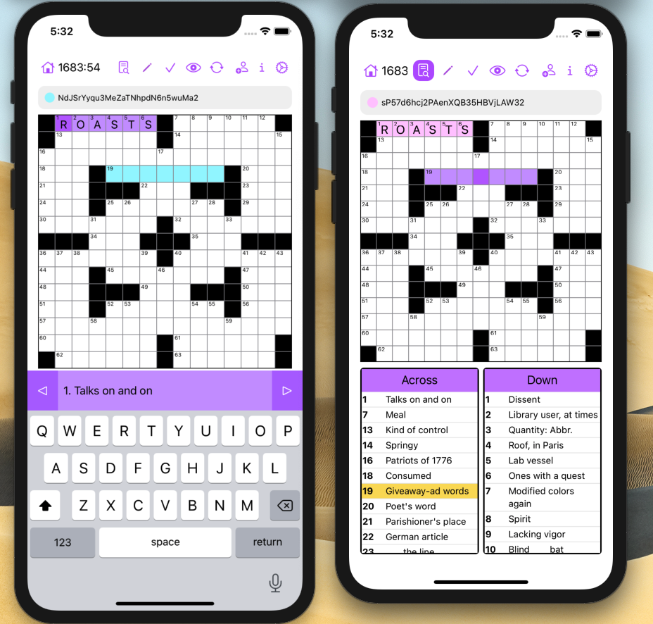

<h1 align="center">Acrossword</h1>

  <a href="#technologies">Technologies</a> •
  <a href="#key-features">Key Features</a> •
  <a href="#project-design-and-organization">Project Design</a> •
  <a href="#building-the-project">Building the project</a> •
  <a href="#Roadmap">Roadmap</a>

An iOS application for realtime collaborative crossword puzzles between friends.

 Development is ongoing! 

## Technologies
- Swift
- SwiftUI, UIKit
- Firebase (Authentication, Firestore, Realtime Database)
- Socket.IO

## Key Features
- Offline singleplayer mode
- Multiplayer mode where friends can collaborate in real-time on crosswords while connected to the internet
- Suite of standard crossword features (pencil mode, check tile/word/puzzle, reveal tile/word/puzzle, clue view mode, autonavigation to next tile after input, double tap to switch between across/down, etc.)
- All data is stored in the cloud. A user can login to a completely different device and their progress will sync

## Project Design and Organization
### General notes
- Files ending in `View` are SwiftUI views and files ending in `VM` are view-models (usually `ObservableObject`s). 
- The `Appdata` class is the `EnvironmentObject` shared by all views, and it contains information about the user's profile and the currently displayed view. Changing `currentView` by calling the `changeView<V: View>(view: View)` method changes the view. 

The app is split into five main sections. Currently, sections 1-3 (the core of the game) are complete and the app is functional. 
### 1. Login 
Users must have an account to play. This section of the app facilitates signups, logins, and password resets, along with creating profiles and storing them in a database. Much of the heavy lifting is done with Firebase Authentication. Users must sign up with their email, a unique username, and a password. 
### 2. Home
This is the default view shown when users open the app after logging in. Recently played crosswords are displayed here, stored as [TO-DO: Write this section]. 
### 3. Game
This section contains the core of the app, and it facilitates loading in the crossword, user input, autonavigating to the next tile after an input, clue navigation,  checks/reveals, answer checking, crossword data persistence, communication with the Websocket server, displaying friends' inputs and locations on the board, syncing board actions with friends, and sharing the crossword with friends, among other things. This section contains the code for making both singleplayer and multiplayer games run smoothly and saving game progress. 
### 4. Library
This section allows users to pick puzzles from the archive. 
### 5. Friends
This section displays the user's friends and facilitates adding new friends as well as an alternate way to invite friends to games.

## Building the Project
Clone the repository and run `pod install`. 

## Roadmap
This app was designed with cross-platform compatability in mind. Ideally, users can play on their phones with friends who are playing on a website. Users should also be able to switch from the app to the website and vice versa with ease. Unfortunately, developing apps takes forever and college is a struggle, so it'll be a while before I can implement the web app. 

Here's a broad to-do list for the app:
- Home view
- Puzzle selection view
- Friend requests view
- Friend statuses (e.g. online) view
- Metrics (e.g. # puzzles solved)
- Settings
